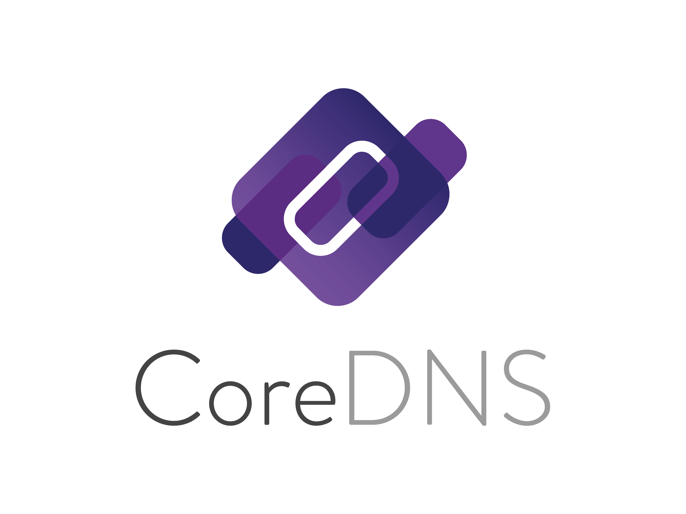

<a id="readme-top"></a>


<!-- PROJECT LOGO -->
<br />
<div align="center">
  <a href="https://github.com/Epic-Nova/CoreDNS-QuickStart">
    
  </a>
  
<h3 align="center">CoreDNS-QuickStart</h3>

  <p align="center">
    A quick start guide and setup for CoreDNS to help you get up and running with a customized DNS server setup.
    <br />
    <a href="https://coredns.io/manual/toc/"><strong>Explore the CoreDNS docs »</strong></a>
    <br />
    <br />
    <a href="https://github.com/Epic-Nova/CoreDNS-QuickStart/blob/master/.github/FAQ.md">FAQ</a>
    &middot;
    <a href="https://github.com/Epic-Nova/CoreDNS-QuickStart/issues/new?template=bug_report.md">Report Bug</a>
    &middot;
    <a href="https://github.com/Epic-Nova/CoreDNS-QuickStart/issues/new?template=feature_request.md">Request Feature</a>
  </p>
</div>


<!-- PROJECT SHIELDS -->

<div align="center">
  <h2>Built With</h2>

  <a href="">![Go][Go-Shield-URL]</a>
  <a href="">![Docker][Docker-Shield-URL]</a>

</div>

<div align="center">
  <h2>Stats</h2>

  <a href="">[![Contributors][Contributors-Shield-URL]][Contributors-URL]</a>
  <a href="">[![Forks][Forks-Shield-URL]][Forks-URL]</a>
  <a href="">[![Stargazers][Stars-Shield-URL]][Stars-URL]</a>
  <a href="">[![Issues][Issues-Shield-URL]][Issues-URL]</a>
  <a href="">[![project_license][License-Shield-URL]][License-URL]</a>

</div>


<!-- TABLE OF CONTENTS -->
<details>
  <summary>Table of Contents</summary>
  <ol>
    <li>
      <a href="#-about-the-project">About The Project</a>
    </li>
    <li>
      <a href="./.github/DEVELOPMENT.md">Getting Started</a>
      <ul>
        <li><a href="./.github/DEVELOPMENT.md#-install-required-software">Prerequisites</a></li>
        <li><a href="./.github/DEVELOPMENT.md#-basic-setup">Installation</a></li>
      </ul>
    </li>
    <li><a href="#-usage">Usage</a></li>
    <li><a href="#-roadmap">Roadmap</a></li>
    <li><a href="#-contributing">Contributing</a></li>
    <li><a href="#-license">License</a></li>
    <li><a href="#-contact">Contact</a></li>
    <li><a href="#-acknowledgments">Acknowledgments</a></li>
  </ol>
</details>


<!-- ABOUT THE PROJECT -->
## 🧩 About The Project
<div align="center">
  


**CoreDNS-QuickStart** is a ready-to-use configuration and setup guide for CoreDNS, helping you quickly deploy a customized DNS server. It provides pre-configured zones, scripts for automation, and best practices for secure DNS configuration.

</div>
<p align="right">(<a href="#readme-top">back to top</a>)</p>

---


<!-- USAGE EXAMPLES -->
## 🛠️ Usage

You'll find practical usage examples and configurations inside the project's ```SanitizedDNS``` directory. These demonstrate how to configure and work with CoreDNS effectively.

Examples include:

  - 📁 **Zone files in the Zones directory**
  - 🧪 **Certificate management in the Certs directory**
  - 🔧 **Automation scripts in the Scripts directory**

*For more documentation and advanced scenarios, check the official [CoreDNS Documentation](https://coredns.io/manual/toc/).*

<p align="right">(<a href="#readme-top">back to top</a>)</p>

---


<!-- ROADMAP -->
## 🗺️ Roadmap

📌 You can track our progress and submit ideas or feedback through the project's issue tracker.

*For a full list of upcoming features and bugs, check the open issues in this repository.*

<p align="right">(<a href="#readme-top">back to top</a>)</p>

---


<!-- CONTRIBUTING -->
## 🤝 Contributing

Contributions are what make the open source community such an amazing place to learn, inspire, and create — and **any contributions are truly appreciated.**

If you have ideas to improve CoreDNS-QuickStart, feel free to:

  - 🛠 Fork the repository
  - 🧪 Implement your feature or fix
  - 📬 Submit a pull request
  - 📣 Or open a bug report, feature request, or question issue

> [!TIP]
> 📄 For detailed contribution guidelines, please see [CONTRIBUTING.md](./.github/CONTRIBUTING.md)

If you're interested in contributing to CoreDNS itself, please visit:
- [CoreDNS Community Guidelines](https://coredns.io/community/)
- [CoreDNS GitHub Repository](https://github.com/coredns/coredns)

<p align="right">(<a href="#readme-top">back to top</a>)</p>

### 🏆 Top contributors:

<div align="center">
  <a href="https://github.com/Epic-Nova/CoreDNS-QuickStart/graphs/contributors">
    
  </a>
</div>

---


<!-- LICENSE -->
## 📄 License

### Distributed under the **MIT License.** See [`LICENSE`](./LICENSE) for more information.

---

<p align="right">(<a href="#readme-top">back to top</a>)</p>

---


<!-- CONTACT -->
## 📬 Contact

### 🔗 Connect with Us:
- Submit issues on this repository for questions, bug reports, or feature requests
- For CoreDNS-specific questions, refer to the [CoreDNS Community](https://coredns.io/community/)

<p align="right">(<a href="#readme-top">back to top</a>)</p>

---


<!-- SUPPORT -->
## 💖 Support

If you find this project useful or just want to support ongoing development, consider giving the repo a ⭐, sharing it with others, or contributing to the codebase!

<p align="right">(<a href="#readme-top">back to top</a>)</p>

---


<!-- ACKNOWLEDGMENTS -->
## 🙏 Acknowledgments

Big thanks to:
* [README Template][Readme-Template-URL]
* [CoreDNS Project](https://github.com/coredns/coredns) - For creating a flexible, extensible DNS server

<p align="right">(<a href="#readme-top">back to top</a>)</p>


<!-- MARKDOWN LINKS & IMAGES -->
<!-- https://www.markdownguide.org/basic-syntax/#reference-style-links -->
[Contributors-Shield-URL]: https://img.shields.io/github/contributors/Epic-Nova/CoreDNS-QuickStart.svg?style=for-the-badge
[Contributors-URL]: https://github.com/Epic-Nova/CoreDNS-QuickStart/graphs/contributors

[Forks-Shield-URL]: https://img.shields.io/github/forks/Epic-Nova/CoreDNS-QuickStart.svg?style=for-the-badge
[Forks-URL]: https://github.com/Epic-Nova/CoreDNS-QuickStart/network/members

[Stars-Shield-URL]: https://img.shields.io/github/stars/Epic-Nova/CoreDNS-QuickStart.svg?style=for-the-badge
[Stars-URL]: https://github.com/Epic-Nova/CoreDNS-QuickStart/stargazers

[Issues-Shield-URL]: https://img.shields.io/github/issues/Epic-Nova/CoreDNS-QuickStart.svg?style=for-the-badge
[Issues-URL]: https://github.com/Epic-Nova/CoreDNS-QuickStart/issues

[License-Shield-URL]: https://img.shields.io/github/license/Epic-Nova/CoreDNS-QuickStart.svg?style=for-the-badge
[License-URL]: https://github.com/Epic-Nova/CoreDNS-QuickStart/blob/master/LICENSE

[Go-Shield-URL]: https://img.shields.io/badge/go-%2300ADD8.svg?style=for-the-badge&logo=go&logoColor=white
[Docker-Shield-URL]: https://img.shields.io/badge/docker-%230db7ed.svg?style=for-the-badge&logo=docker&logoColor=white

[Readme-Template-URL]: https://github.com/othneildrew/Best-README-Template